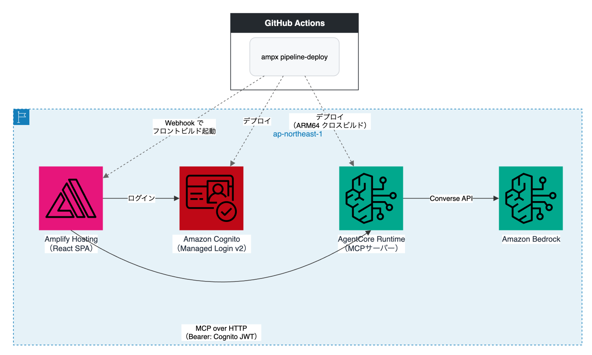

# amplify-gen2-agentcore-sample

Amplify Gen2 と Amazon Bedrock AgentCore Runtime を GitHub Actions で統合したサンプルアプリケーション。

ログインしたユーザーがブラウザから MCP プロトコル越しに LLM に質問できる、認証付き Web チャットアプリです。

> この実装の背景・解説・ハマりポイントは記事で詳しく説明しています。

## アーキテクチャ



**デプロイの役割分担がポイントです。**

- **GitHub Actions** — `ampx pipeline-deploy` でバックエンド一式（Cognito + AgentCore）をデプロイ。AgentCore コンテナの ARM64 クロスビルドもここで実行
- **Amplify Hosting** — フロントエンドのビルドとホスティングのみ。GitHub Actions から Webhook で起動

Amplify Gen2 の CI/CD 環境では Docker が動かないため、バックエンドデプロイを GitHub Actions に分離しています。

## ディレクトリ構成

```
.
├── amplify/                    # Amplify Gen2 バックエンド定義（CDK）
│   ├── auth/
│   │   ├── resource.ts         # Cognito 設定（Managed Login v2、preSignUp トリガー）
│   │   └── pre-signup/
│   │       └── handler.ts      # メールドメイン制限 Lambda
│   ├── backend.ts              # AgentCore Runtime CDK コンストラクト
│   └── tsconfig.json
├── server/                     # MCP サーバー（AgentCore コンテナイメージ）
│   ├── src/
│   │   └── server.ts           # Express + MCP SDK（ask ツール）
│   ├── Dockerfile              # ARM64、node:22-slim マルチステージビルド
│   ├── package.json
│   └── tsconfig.json
├── host/                       # React フロントエンド（MCP クライアント）
│   └── src/
│       ├── App.tsx             # チャット UI
│       ├── main.tsx            # AuthGuard（Cognito Managed Login へリダイレクト）
│       ├── amplify-config.ts   # AgentCore エンドポイント URL の組み立て
│       └── hooks/
│           └── useMcpClient.ts # Bearer トークン付き MCP 接続
├── .github/workflows/
│   └── deploy.yml              # GitHub Actions デプロイワークフロー
├── amplify.yml                 # Amplify Hosting フロントエンドビルド定義
├── package.json
├── pnpm-workspace.yaml
└── mise.toml                   # Node.js 22.22.0
```

## 前提条件

- **Node.js** 22 以上（`mise.toml` で 22.22.0 固定）
- **pnpm** 11
- **Docker**（ローカルでのコンテナビルド・テスト用）
- **AWS アカウント**
  - Amazon Bedrock の `ap-northeast-1` リージョンで `jp.anthropic.claude-sonnet-4-6` の利用申請済み
  - GitHub OIDC プロバイダーが登録済み（後述）
- **GitHub リポジトリ**（Actions 実行用）
- **Amplify Hosting アプリ**（コンソールで作成済み）

## セットアップ

### 1. AWS 側の準備

#### GitHub OIDC プロバイダーの登録

AWS コンソール → IAM → ID プロバイダー で、以下を追加します（未登録の場合のみ）。

- プロバイダータイプ: `OpenID Connect`
- プロバイダー URL: `https://token.actions.githubusercontent.com`
- 対象者: `sts.amazonaws.com`

#### IAM ロールの作成

GitHub Actions から AssumeRole できる IAM ロールを作成します。

**信頼ポリシー:**

```json
{
  "Version": "2012-10-17",
  "Statement": [
    {
      "Effect": "Allow",
      "Principal": {
        "Federated": "arn:aws:iam::{AWS_ACCOUNT_ID}:oidc-provider/token.actions.githubusercontent.com"
      },
      "Action": "sts:AssumeRoleWithWebIdentity",
      "Condition": {
        "StringEquals": {
          "token.actions.githubusercontent.com:aud": "sts.amazonaws.com"
        },
        "StringLike": {
          "token.actions.githubusercontent.com:sub": "repo:{GITHUB_OWNER}/{GITHUB_REPO}:*"
        }
      }
    }
  ]
}
```

**権限ポリシー:** 開発時は `AdministratorAccess` が最も手軽です。本番環境では Amplify・CDK・ECR・AgentCore 等の必要最小限の権限に絞ることを推奨します。

### 2. Amplify Hosting アプリの作成

1. [Amplify コンソール](https://console.aws.amazon.com/amplify/) → **新しいアプリを作成**
2. **「ウェブアプリをホスト」** を選択し、このリポジトリを接続
3. ビルド設定はリポジトリの `amplify.yml` が自動で使用されます
4. **「このブランチの自動デプロイを有効にする」をオフにする**（git push による自動ビルドを無効化。デプロイは GitHub Actions + Webhook に一本化します）
5. アプリを保存し、**アプリ ID**（`d1xxxxxxxxx` 形式）を控える

#### Incoming Webhook の作成

Amplify コンソール → アプリ設定 → **Webhook** → Webhook を作成 → main ブランチを選択 → Webhook URL を控える

### 3. GitHub Secrets の設定

リポジトリの **Settings → Secrets and variables → Actions** に以下を追加します。

| シークレット名 | 値 |
|---|---|
| `AWS_ROLE_ARN` | 手順 1 で作成した IAM ロールの ARN（例: `arn:aws:iam::123456789012:role/MyDeployRole`） |
| `AMPLIFY_APP_ID` | 手順 2 で確認したアプリ ID（例: `d1xxxxxxxxx`） |
| `AMPLIFY_WEBHOOK_URL` | 手順 2 で作成した Webhook URL |
| `ALLOWED_EMAIL_DOMAIN` | サインアップを許可するメールドメイン（例: `example.com`）。このドメイン以外はサインアップ不可になります。 |

### 4. デプロイ実行

`main` ブランチに push すると GitHub Actions が自動で起動します。

```bash
git push origin main
```

または GitHub コンソールの **Actions → Deploy → Run workflow** で手動実行もできます。

デプロイの流れ:
1. QEMU + Buildx で ARM64 クロスビルド環境を構築
2. `ampx pipeline-deploy` で Cognito + AgentCore Runtime をデプロイ（コンテナのビルド・ECR push・AgentCore Runtime 更新を含む）
3. Amplify Incoming Webhook でフロントエンドビルドを起動

Amplify Hosting のビルドが完了したら、アプリ URL（`https://main.{AMPLIFY_APP_ID}.amplifyapp.com/`）にアクセスできます。

## ローカル開発

ローカルでは Amplify サンドボックスで Cognito を立ち上げ、MCP サーバーを直接 `localhost` で起動します。AgentCore Runtime を介さないため、ホットリロードが効く通常の Web 開発体験になります。

### 手順

```bash
# 1. 依存関係のインストール
pnpm install

# 2. .env ファイルの作成（Amplify サンドボックス用）
cat > .env <<'EOF'
ALLOWED_EMAIL_DOMAIN=your-domain.com
AUTH_REDIRECT_URLS=http://localhost:5173/
EOF

# 3. Amplify サンドボックスを起動（初回は数分かかります）
#    amplify_outputs.json が生成されます
pnpm sandbox

# 別ターミナル: MCP サーバーを起動
pnpm dev:server   # http://localhost:8080/mcp

# 別ターミナル: フロントエンドを起動（MCP を localhost に向けるため env を指定）
VITE_MCP_ENDPOINT=http://localhost:8080/mcp pnpm dev:host
```

> **`VITE_MCP_ENDPOINT`** を設定すると `amplify_outputs.json` の AgentCore エンドポイントを無視して指定先に接続します。Bearer トークンも付与されないため、ローカルサーバー側での認証設定は不要です。

### ローカルでの Docker ビルド確認

```bash
# ARM64 イメージのビルド（Apple Silicon では --platform 不要）
docker build server/ -t sample-agent-server

# 起動テスト（AgentCore は PORT=8000 を渡す）
docker run --rm -p 8000:8000 \
  -e PORT=8000 \
  -e AWS_REGION=ap-northeast-1 \
  -e AWS_ACCESS_KEY_ID=<key> \
  -e AWS_SECRET_ACCESS_KEY=<secret> \
  sample-agent-server

# MCP initialize リクエストで疎通確認
curl -s -X POST http://localhost:8000/mcp \
  -H "Content-Type: application/json" \
  -d '{"jsonrpc":"2.0","method":"initialize","params":{"protocolVersion":"2024-11-05","capabilities":{},"clientInfo":{"name":"test","version":"1.0"}},"id":1}'
```

## 注意点

### AgentCore Runtime のポート制約

AgentCore Runtime は MCP プロトコルの契約として、コンテナがポート **`8000`** の **`/mcp`** でリッスンする必要があります。別のポートで起動した場合、AgentCore 側でタイムアウトするだけで原因が分かりにくいため注意してください。CDK の `environmentVariables` で `PORT: "8000"` を渡しています。

### ARM64 クロスビルドには QEMU + Buildx の両方が必要

GitHub Actions の `ubuntu-latest` は AMD64 です。AgentCore Runtime は ARM64 専用のため、クロスビルドが必要です。**QEMU だけでなく Buildx も必須**です。どちらか一方では動きません。

```yaml
- uses: docker/setup-qemu-action@...
  with:
    platforms: arm64
- uses: docker/setup-buildx-action@...  # ← これも必要
```

### Dockerfile のベースイメージは `node:22-slim`（glibc）

`node:22-alpine`（musl libc）は QEMU の ARM64 エミュレーション上でクラッシュすることがあります（ローカルの Apple Silicon では再現せず CI 上のみで失敗する）。`node:22-slim` を使用しています。

### `amplify_outputs.json` はコミットしない

このファイルには Cognito の設定情報（User Pool ID、App Client ID 等）が含まれます。`.gitignore` に含まれているため、誤ってコミットしないよう注意してください。

## ライセンス

MIT
